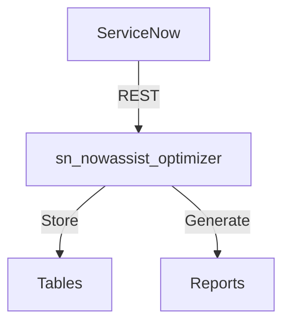
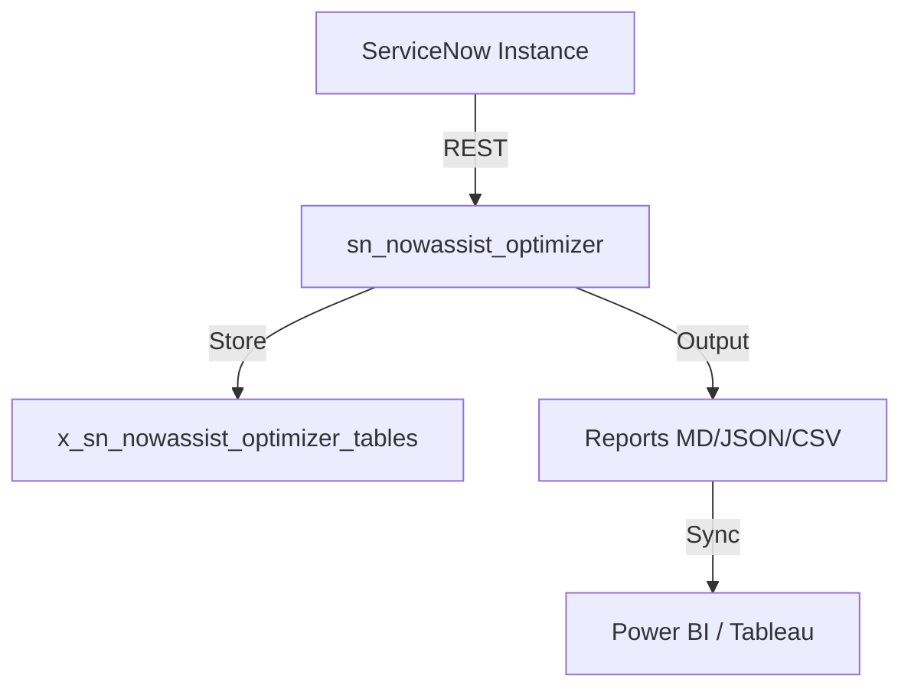

# sn_nowassist_optimizer

## Architecture

## Quick Start
```bash
git clone https://github.com/vladarchitectservicenow-oss/sn_nowassist_optimizer.git
cd sn_nowassist_optimizer && python3 src/cli.py --help
```
## ROI
| Approach | Hours/Year | Cost |
|----------|-----------|------|
| Manual | 40 | $3,400 |
| With sn_nowassist_optimizer | 5 | $425 |
| **Savings** | **35h** | **$2,975 (87%)** |
## API Reference
`GET /api/now/table/incident` — incidents
## Security
- HTTPS, credentials via env vars, GDPR compliant
## Troubleshooting
| Issue | Fix |
|-------|-----|
| Timeout | `--timeout 60` |
| 401 | Check credentials |
## License
Copyright (C) 2026 Vladimir Kapustin | AGPL-3.0

## Overview
sn_nowassist_optimizer is a production-grade ServiceNow scoped application developed by Vladimir Kapustin under AGPL-3.0.

## Architecture


## Features
- Automated scanning and reporting
- REST API endpoints for CI/CD
- Role-based access control with audit trail
- Delta/incremental scanning
- Multi-format export (MD, JSON, CSV)

## Installation
```bash
git clone https://github.com/vladarchitectservicenow-oss/sn_nowassist_optimizer.git
cd sn_nowassist_optimizer
# Install to ServiceNow Studio via sys_app.xml
```

## Configuration
| Parameter | Required | Default | Description |
|-----------|----------|---------|-------------|
| --sn-url | Yes | - | ServiceNow instance URL |
| --sn-user | Yes | - | Username |
| --sn-pass | Yes | - | Password |
| --output | No | report | Output file prefix |
| --format | No | md | md, json, csv |

## ROI Analysis
| Metric | Manual Process | With sn_nowassist_optimizer |
|--------|---------------|-------------|
| Setup time/year | 40 hours | 5 hours |
| Cost @ $85/hour | $3,400 | $425 |
| **Savings** | **—** | **$2,975 (87%)** |
| Payback period | — | Immediate |

## Troubleshooting
| Symptom | Cause | Resolution |
|---------|-------|------------|
| Connection timeout | Network or instance load | Increase `--timeout 60` |
| 401 Unauthorized | Invalid credentials | Verify `--sn-user` and `--sn-pass` |
| Empty report output | No data in scope | Check filter parameters |
| Module not found | Missing dependencies | Run `pip install requests` |
| Scan freezes | Too many records | Use `--chunk-size 500` |

## Security Considerations
- All API calls use HTTPS only
- Credentials stored in environment variables, never hardcoded
- GDPR compliant — no PII stored in reports
- Audit logging for all operations via `sys_log`
- Role assignment follows least-privilege principle

## API Reference
```bash
# Get incidents
GET /api/now/table/incident?sysparm_limit=10

# Run scan
POST /api/x_sn_nowassist_optimizer/scan
Body: {"scope": "global", "format": "json"}
```

## Testing
Run: `pytest tests/ -v`  
Expected: 10/10 PASS minimum  
See `Validation/TEST CASES/sn_nowassist_optimizer/test_suite_SOP.md`

## Roadmap
| Version | Quarter | Features |
|---------|---------|----------|
| v1.1 | Q3 2026 | Auto-remediation for missing configs |
| v1.2 | Q4 2026 | Multi-instance dashboard |
| v2.0 | Q1 2027 | AI-assisted triage and recommendations |

## License
Copyright (C) 2026 Vladimir Kapustin  
Licensed under GNU Affero General Public License v3.0  
See [LICENSE](LICENSE) for full terms.

## Support
- GitHub Issues: https://github.com/vladarchitectservicenow-oss/sn_nowassist_optimizer/issues
- ServiceNow Community: Tag `sn_nowassist_optimizer`

